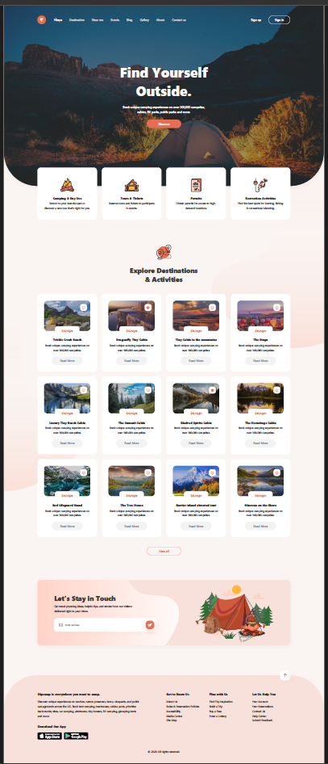
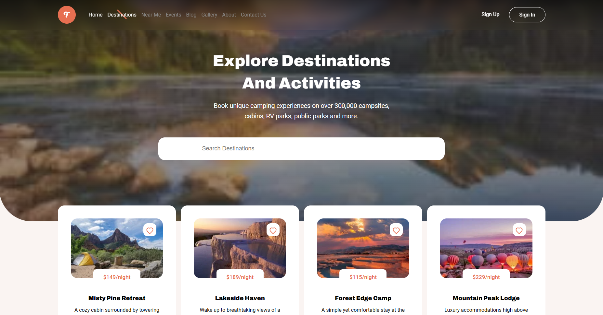
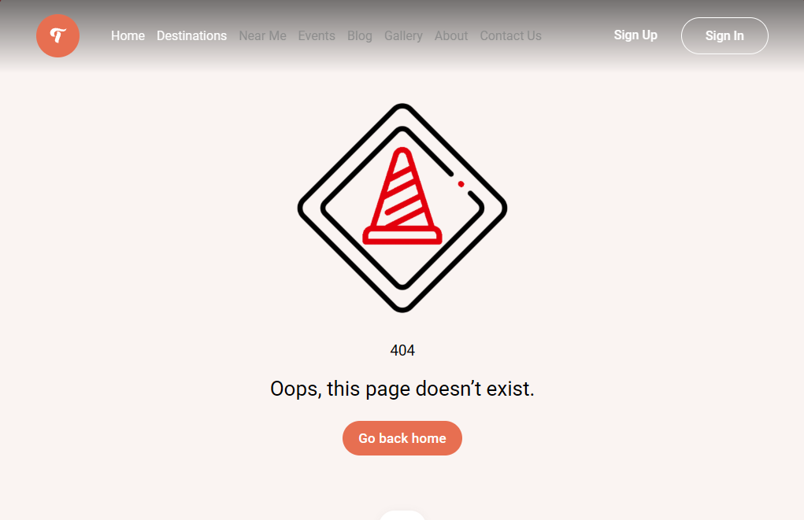
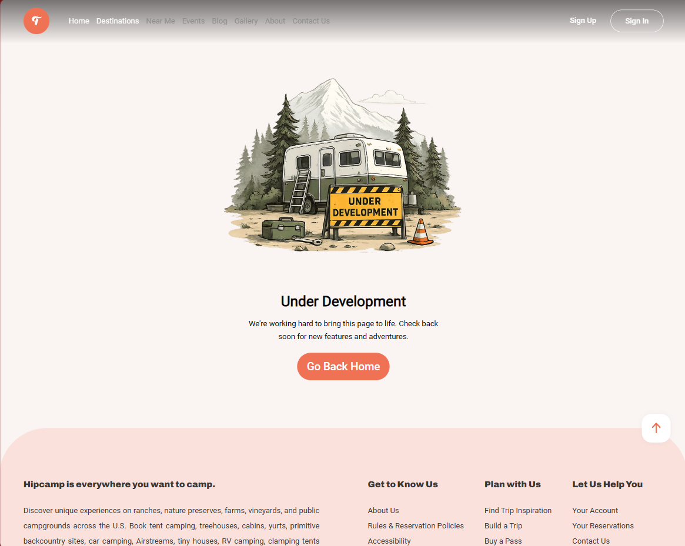
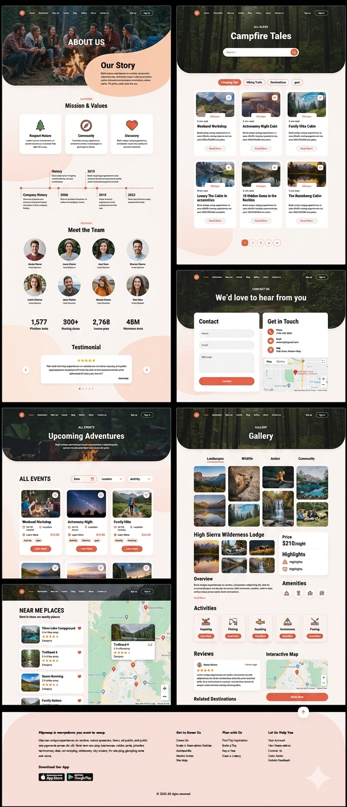

# 🌲 HipCamp

A modern outdoor travel platform built with Vue and TypeScript, designed to help users discover nature-based destinations, cabins, camper vans, and unique outdoor experiences.

HipCamp aims to make finding your next adventure simple, enjoyable, and inspiring. Whether you're looking for a peaceful cabin in the woods or planning a weekend camping trip, HipCamp is being built to become a central hub for outdoor exploration.

## 🚀 Live Demo

🔗 https://hipcamp-vue-jade.vercel.app/

## 📂 Repository

🔗 https://github.com/Alireza8203-gol/hipcamp-vue

---

## 📸 Screenshots

### Home Page



The landing page introduces the platform and showcases featured destinations in a clean, responsive layout.

### Destinations Page



Browse available destinations, search for specific locations, and save your favorite places.

### 404 Page



A custom-designed page displayed when users navigate to a route that does not exist.

### Under Development!!



A custom-designed page displayed when users navigate to a route that is yet to be completed!

### Future Roadmap Preview



A preview of upcoming features and pages planned for future releases.

---

## ✨ Current Features

* Responsive design for desktop, tablet, and mobile devices
* Browse outdoor destinations
* Search destinations by name
* Like and save favorite destinations
* Dynamic routing structure
* Custom 404 page
* Clean component-based architecture
* Built with TypeScript

---

## 🛠️ Tech Stack

### Frontend

* Vue 3
* Vue Router
* TypeScript
* Vanilla CSS

### Tooling

* Vite
* ESLint
* Prettier

---

## 📁 Project Structure

```text
src/
├── assets/
├── components/
├── data/
├── router/
├── views/
├── App.vue
└── main.ts
```

---

## 🔮 Planned Features

HipCamp is actively being expanded with additional features and sections:

### Destination Experience

* Destination details page
* Nearby destinations ("Near Me")
* Destination categories

### Community

* User accounts
* Authentication
* User profiles
* Favorite destinations sync

### Content

* Blog page
* Events center
* Community gallery
* Outdoor guides and tips

### Company

* About Us page
* Contact Us page

---

## 💻 Installation

Clone the repository:

```bash
git clone https://github.com/Alireza8203-gol/hipcamp-vue.git
```

Navigate into the project:

```bash
cd hipcamp-vue
```

Install dependencies:

```bash
npm install
```

Start the development server:

```bash
npm run dev
```

Build for production:

```bash
npm run build
```

---

## 🎯 Project Goals

This project was created to strengthen practical frontend development skills while building a real-world application from design to deployment.

Key areas of focus include:

* Vue 3 development
* TypeScript integration
* Component architecture
* Responsive design
* Routing and navigation
* State management patterns
* Scalable project structure

---

## 🗺️ Roadmap

* [x] Home page
* [x] Destinations page
* [x] Search functionality
* [x] Favorites system
* [x] Responsive design
* [ ] Destination details page
* [ ] Near Me locations
* [ ] Events center
* [ ] Blog section
* [ ] Community gallery
* [ ] User authentication
* [ ] User accounts
* [ ] About page
* [ ] Contact page

---

## 👨‍💻 Author

**Alireza**

Frontend Developer passionate about creating modern, responsive, and user-friendly web experiences.

GitHub: https://github.com/Alireza8203-gol

---

⭐ If you like this project, consider giving it a star.
